# Hi there, I'm Krupali Pilgulwar 

**Enterprise Quality Architect | AI-Powered Product Builder | Full-Stack Developer**

---

### About Me

Enterprise Quality Architect at Rocket with 18+ years of experience in quality engineering, full-stack development, and AI-powered product development.

- Built **Quality Intelligence (QI)** — a platform scoring 8,000+ applications with real-time quality analytics
- Built an **AI-powered API Test Generator** using AWS Bedrock and MCP (Model Context Protocol)
- Currently pursuing **PG in AI & Machine Learning** at Purdue University (in collaboration with IBM)
- Daily workflow includes **GitHub Copilot**, **Claude Code**, and **Cline**

---

### Tech Stack

**Languages**

**Frameworks & Libraries**

**AI & Cloud**

**DevOps & Tools**

**Testing**

---

### GitHub Stats

&nbsp;

&nbsp;

 

---

### Recently Updated Projects

<!-- RECENT_REPOS:START -->
| Project | Description | Language | Updated |
|---------|-------------|----------|---------|
| [api-test-generator](https://github.com/QualityStackAI/api-test-generator) | AI powered API Test Generator |  | Mar 29, 2026 |
| [applied_data_science_learning_sales_analysis](https://github.com/rpkrupali1/applied_data_science_learning_sales_analysis) | Applied data science with python - create states sales analysis  |  | Mar 29, 2026 |
| [krupali_portfolio](https://github.com/rpkrupali1/krupali_portfolio) | — |  | Mar 20, 2026 |
| [insomnia](https://github.com/rpkrupali1/insomnia) | — |  | Aug 15, 2024 |
| [image_master](https://github.com/rpkrupali1/image_master) | ImageMaster is a versatile image processing application designed to empower users to effortlessly resize and split images for various purposes, including printing large-scale posters, banners, and artworks. |  | Mar 18, 2024 |
| [task-management-nestjs](https://github.com/rpkrupali1/task-management-nestjs) | — |  | Aug 1, 2023 |
| [task-management](https://github.com/rpkrupali1/task-management) | — |  | Jun 26, 2023 |
| [algoritms](https://github.com/rpkrupali1/algoritms) | different algorithms |  | Dec 22, 2022 |
<!-- RECENT_REPOS:END -->

---

### Featured Projects

#### AI & Quality Engineering

| Project | Description | Tech |
|---------|-------------|------|
| [api-test-generator](https://github.com/QualityStackAI/api-test-generator) | AI-powered API Test Generator using Bedrock & MCP |   |

#### AI & Data Science

| Project | Description | Tech |
|---------|-------------|------|
| [applied_data_science_learning_sales_analysis](https://github.com/rpkrupali1/applied_data_science_learning_sales_analysis) | Applied data science with Python — state sales analysis |   |
| [python-meteorites](https://github.com/rpkrupali1/python-meteorites) | NASA data to find meteor landing sites |  |
| [image_master](https://github.com/rpkrupali1/image_master) | Image processing app for resizing & splitting images |  |

#### Full-Stack Applications

| Project | Description | Tech |
|---------|-------------|------|
| [task-management-nestjs](https://github.com/rpkrupali1/task-management-nestjs) | Task management API |   |
| [shop-shine](https://github.com/rpkrupali1/shop-shine) | Online shopping platform |   |
| [kitchen-around-you](https://github.com/rpkrupali1/kitchen-around-you) | Find cooking programs that interest you |  |
| [book-search-engine](https://github.com/rpkrupali1/book-search-engine) | Search and save your favorite books |   |
| [News4U](https://github.com/rpkrupali1/News4U) | Search engine for news and information |  |

#### Testing & Automation

| Project | Description | Tech |
|---------|-------------|------|
| [selenium-java-framework](https://github.com/rpkrupali1/selenium-java-framework) | Selenium automation Java framework |   |
| [selenium-java](https://github.com/rpkrupali1/selenium-java) | Selenium automation script samples |   |

#### Portfolio

| Project | Description | Tech |
|---------|-------------|------|
| [krupali_portfolio](https://github.com/rpkrupali1/krupali_portfolio) | Personal portfolio website |   |

---

### Currently Learning

- Deep Learning, NLP, Computer Vision, Generative AI
- TensorFlow / Keras
- Agentic AI & LLM Orchestration

---

